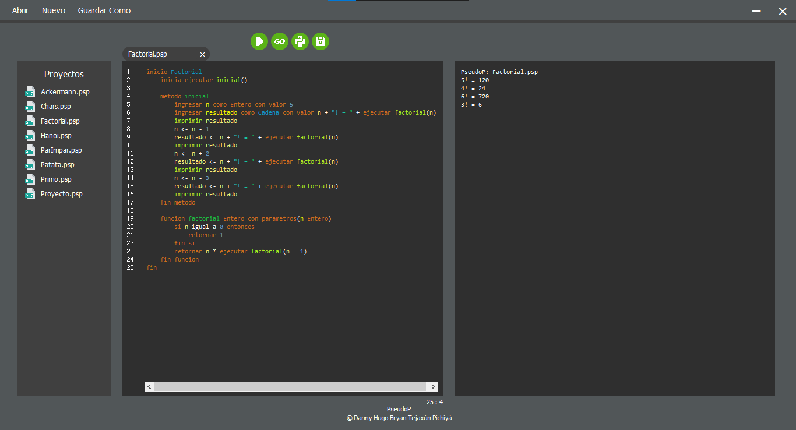

# PseudoP
## Intérprete de Pseudocódigo: JFlex y CUP  
* Implementa patrón de diseño Interpreter.

## Traductor a Código Go y Python

## VSCode Theme


## GitHub Theme


## Eclipse Theme


## Gramática Libre del Contexto
```html
<INIT> ::=
    'inicio' TK_id <INSTSGLOBAL> 'fin' |
    'inicio' TK_id 'fin'

<INSTSGLOBAL> ::=
    <INSTSGLOBAL>  <INSTGLOBAL> |
    <INSTGLOBAL>

<INSTGLOBAL> ::=
    <CALLMAINFUNC> |
    <INITVAR>      |
    <DECLFUNC>

<INSTRUCTIONS> ::=
    <INSTRUCTIONS> <INSTRUCTION> |
    <INSTRUCTION>

<INSTRUCTION> ::=
    <INITVAR>        |
    <ASSIGN>         |
    <IF>             |
    <SWITCH>         |
    <FOR>            |
    <WHILE>          |
    <DOWHILE>        |
    <CALLFUNC>       |
    <PRINT>          |
    'retornar' <EXP> |
    'regresar'       |
    'continuar'      |
    'detener'

<CALLMAINFUNC> ::=
    'inicia' <CALLFUNC>

<INITVAR> ::=
    'ingresar' <LISTID> 'como' <TYPE> 'con valor' <EXP>

<ASSIGN> ::=
    <LISTID> '<-' <EXP>

<LISTID> ::=
    <LISTID> ',' TK_id |
    TK_id

<DECLFUNC> ::=
    'funcion' TK_id <TYPE> 'con parametros' '(' <LISTPARAMS> ')' <INSTFUNC> |
    'funcion' TK_id <TYPE> <INSTFUNC>                                       |
    'metodo'  TK_id 'con parametros' '(' <LISTPARAMS> ')' <INSTMETH>        |
    'metodo'  TK_id <INSTMETH>

<INSTFUNC> ::=
    <INSTRUCTIONS> 'fin funcion' |
    'fin funcion'

<INSTMETH> ::=
    <INSTRUCTIONS> 'fin metodo' |
    'fin metodo'

<LISTPARAMS> ::=
    <LISTPARAMS> ',' TK_id <TYPE> |
    TK_id <TYPE>

<IF> ::=
    'si' <EXP> 'entonces' <ELSEIF> |
    'si' <EXP> 'entonces' <ELSE>   |
    'si' <EXP> 'entonces' <INSTIF>

<ELSEIF> ::=
    <INSTRUCTIONS> 'o si' <EXP> 'entonces' <ELSEIF> |
    <INSTRUCTIONS> 'o si' <EXP> 'entonces' <ELSE>   |
    <INSTRUCTIONS> 'o si' <EXP> 'entonces' <INSTIF> |
    'o si' <EXP> 'entonces' <ELSEIF>                |
    'o si' <EXP> 'entonces' <ELSE>                  |
    'o si' <EXP> 'entonces' <INSTIF>

<ELSE> ::=
    <INSTRUCTIONS> 'de lo contrario' <INSTIF> |
    'de lo contrario' <INSTIF>

<INSTIF> ::=
    <INSTRUCTIONS> 'fin si' |
    'fin si'

<SWITCH> ::=
    'segun' <EXP> 'hacer' <CASESDEFAULT> 'fin segun' |
    'segun' <EXP> 'hacer' 'fin segun'

<CASESDEFAULT> ::=
    <CASES> <DEFAULT> |
    <CASES>           |
    <DEFAULT>

<CASES> ::=
    <CASES> <CASE> |
    <CASE>

<CASE> ::=
    'en caso de ser' <EXP> 'entonces' <INSTRUCTIONS> |
    'en caso de ser' <EXP> 'entonces'

<DEFAULT> ::=
    'de lo contrario' 'entonces' <INSTRUCTIONS> |
    'de lo contrario' 'entonces'

<FOR> ::=
    'para' TK_id '<-' <EXP> 'hasta' <EXP> 'con incremento' <EXP> 'hacer' <INSTFOR> |
    'para' TK_id '<-' <EXP> 'hasta' <EXP> 'hacer' <INSTFOR>

<WHILE> ::=
    'mientras' <EXP>  'hacer' <INSTWHILE>

<DOWHILE> ::=
    <INSTREPEAT> 'cuando' <EXP>

<INSTFOR> ::=
    <INSTRUCTIONS> 'fin para' |
    'fin para'

<INSTWHILE> ::=
    <INSTRUCTIONS> 'fin mientras' |
    'fin mientras'

<INSTREPEAT> ::=
    'repetir' <INSTRUCTIONS> |
    'repetir'

<PRINT> ::=
    'imprimir nl' <EXP> |
    'imprimir'    <EXP>

<TYPE> ::=
    'Cadena'   |
    'Entero'   |
    'Caracter' |
    'Booleano' |
    'Decimal'

<EXP> ::=
    <ARITHMETICS> |
    <RELATIONALS> |
    <LOGICS>      |
    <CALLFUNC>    |
    TK_id         |
    TK_str        |
    TK_char       |
    TK_num        |
    'Verdadero'   |
    'Falso'       |
    '(' <EXP> ')'

<ARITHMETICS> ::=
    <EXP> '+'        <EXP> |
    <EXP> '-'        <EXP> |
    <EXP> '*'        <EXP> |
    <EXP> '/'        <EXP> |
    <EXP> 'potencia' <EXP> |
    <EXP> 'modulo'   <EXP> |
    '-'   <EXP> 

<RELATIONALS> ::=
    <EXP> 'igual a'         <EXP> |
    <EXP> 'diferente de'    <EXP> |
    <EXP> 'menor igual que' <EXP> |
    <EXP> 'mayor igual que' <EXP> |
    <EXP> 'menor que'       <EXP> |
    <EXP> 'mayor que'       <EXP>

<LOGICS> ::=
    <EXP> 'y' <EXP> |
    <EXP> 'o' <EXP> |
    'no'  <EXP>

<CALLFUNC> ::=
    'ejecutar' TK_id '(' <LISTARGS> ')' |
    'ejecutar' TK_id '(' ')'

<LISTARGS> ::=
    <LISTARGS> ',' <EXP> |
    <EXP>
```

## Precedencia de Operadores
| Nivel | Asociatividad  |                                   Token                                     |
|   -   |       -        |                                     -                                       |
|   8   | Izquierda      | ```o```                                                                     |
|   7   | Izquierda      | ```y```                                                                     |
|   6   | Derecha        | ```no```                                                                    |
|   5   | Izquierda      | ```igual a``` ```diferente de```                                            |
|   4   | Izquierda      | ```menor que``` ```menor igual que``` ```mayor que``` ```mayor igual que``` |
|   3   | Izquierda      | ```+``` ```-```                                                             |
|   2   | Izquierda      | ```*``` ```/``` ```modulo```                                                |
|   1   | No Asociativa  | ```potencia```                                                              |
|   0   | Derecha        | ```-```                                                                     |

## Instalación JFlex y CUP
* Descargar la JFlex: [JFlex](https://jflex.de/download.html)
* Descargar la CUP: [CUP](http://www2.cs.tum.edu/projects/cup/)
* Incluir las librerías en el proyecto java.

## Generación de Scanner
```java
import java.io.File;
public class GScanner {
    public static void main(String[] args) {
        jflex.Main.generate(
            new File(
                "src/Language/Scanner.jflex"
            )
        );
    }
}
```

## Generación de Parser
```java
public class GParser {
    public static void main(String[] args) {
        generate();
    }
    public static void generate() {
        try {
            java_cup.Main.main(
                new String[] {
                    "-destdir",
                    "src/Language",
                    "-symbols",
                    "TOK",
                    "-parser",
                    "Parser",
                    "src/Language/Parser.cup"
                }
            );
        }
        catch(Exception e) {
            System.out.println(e);
        }
    }
}
```

## Intérprete con JFlex y CUP
Usuario: [brandonT2002](https://github.com/brandonT2002)  
Repositorio: [MiniJ](https://github.com/brandonT2002/MiniJ)

## Intérprete con JavaCC
Usuario: [bryan967132](https://github.com/bryan967132)  
Repositorio: [MiniJInterpreter](https://github.com/bryan967132/MiniJInterpreter)

## Traductor a C3D con JFlex y CUP
Usuario: [bryan967132](https://github.com/bryan967132)  
Repositorio: [MiniJC3D](https://github.com/bryan967132/MiniJC3D)

## Traductor a Risc-V con JFlex y CUP
Usuario: [bryan967132](https://github.com/bryan967132)  
Repositorio: [MiniJRiscV](https://github.com/bryan967132/MiniJRiscV)