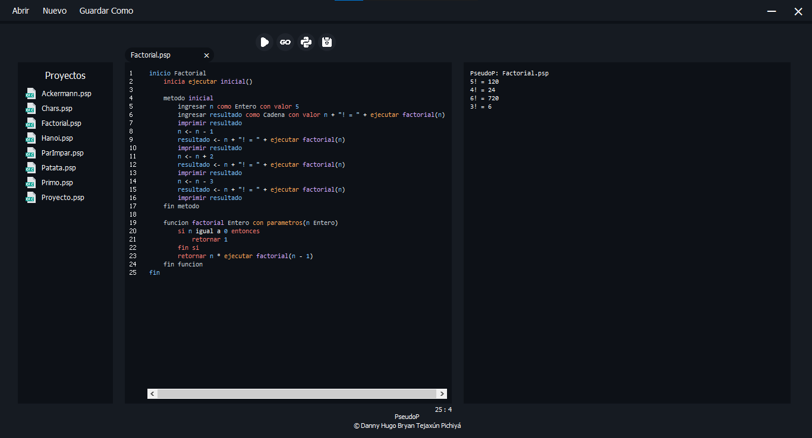

# PseudoP
## Intérprete de Pseudocódigo: JFlex y CUP  
* Implementa patrón de diseño Interpreter.

## VSCode Theme


## GitHub Theme


## Eclipse Theme


## Gramática Libre del Contexto
```java
INIT ::=
    'inicio' TK_id INSTSGLOBAL 'fin' |
    'inicio' TK_id 'fin'             

INSTSGLOBAL ::=
    INSTSGLOBAL  INSTGLOBAL |
    INSTGLOBAL              

INSTGLOBAL ::=
    CALLMAINFUNC |
    DECLID       |
    DECLFUNC     

INSTRUCTIONS ::=
    INSTRUCTIONS INSTRUCTION |
    INSTRUCTION              

INSTRUCTION ::=
    DECLID          |
    ID_ASIGN        |
    IFSTRUCT        |
    SWITCHSTRUCT    |
    LOOPFOR         |
    LOOPWHILE       |
    LOOPDOWHILE     |
    CALLFUNC        |
    PRINT           |
    'return' EXP    |
    'break'         

CALLMAINFUNC ::=
    'inicia' CALLFUNC 

DECLID ::=
    'ingresar' LISTID 'como' TYPE 'con valor' EXP 

ID_ASIGN ::=
    LISTID '<-' EXP 

LISTID ::=
    LISTID ',' TK_id |
    TK_id                 

IFSTRUCT ::=
    'si' EXP 'entonces' ELSEIFSTRUCT |
    'si' EXP 'entonces' ELSESTRUCT   |
    'si' EXP 'entonces' INSTIF       

ELSEIFSTRUCT ::=
    INSTRUCTIONS 'o si' EXP 'entonces' ELSEIFSTRUCT |
    INSTRUCTIONS 'o si' EXP 'entonces' ELSESTRUCT   |
    INSTRUCTIONS 'o si' EXP 'entonces' INSTIF       |
    'o si' EXP 'entonces' ELSEIFSTRUCT              |
    'o si' EXP 'entonces' ELSESTRUCT                |
    'o si' EXP 'entonces' INSTIF                    

ELSESTRUCT ::=
    INSTRUCTIONS 'de lo contrario' INSTIF |
    'de lo contrario' INSTIF              

INSTIF ::=
    INSTRUCTIONS 'fin si' |
    'fin si'              

SWITCHSTRUCT ::=
    'segun' EXP 'hacer' CASESDEFAULT 'fin segun' |
    'segun' EXP 'hacer' 'fin segun'              

CASESDEFAULT ::=
    CASES DEFAULT |
    CASES         |
    DEFAULT       

CASES ::=
    CASES CASE |
    CASE       

CASE ::=
    'en caso de ser' EXP 'entonces' INSTRUCTIONS |
    'en caso de ser' EXP 'entonces'              

DEFAULT ::=
    'de lo contrario' 'entonces' INSTRUCTIONS |
    'de lo contrario' 'entonces'              

LOOPFOR ::=
    'para' TK_id '<-' EXP 'hasta' EXP 'con incremento' EXP 'hacer' INST_FOR |
    'para' TK_id '<-' EXP 'hasta' EXP 'hacer' INST_FOR                      

INST_FOR ::=
    INSTRUCTIONS 'fin para' |
    'fin para'              

LOOPWHILE ::=
    'mientras' EXP  'hacer' INST_WHILE 

LOOPDOWHILE ::=
    INST_REPEAT 'cuando' EXP 

INST_WHILE ::=
    INSTRUCTIONS 'fin mientras' |
    'fin mientras'              

INST_REPEAT ::=
    'repetir' INSTRUCTIONS |
    'repetir'              

DECLFUNC ::=
    'funcion' TK_id TYPE 'con parametros' '(' LISTPARAMS ')' INST_FUNC |
    'funcion' TK_id TYPE INST_FUNC                                     |
    'metodo'  TK_id 'con parametros' '(' LISTPARAMS ')' INST_METH      |
    'metodo'  TK_id INST_METH                                          

INST_FUNC ::=
    INSTRUCTIONS 'fin funcion' |
    'fin funcion'              

INST_METH ::=
    INSTRUCTIONS 'fin metodo' |
    'fin metodo'              

LISTPARAMS ::=
    LISTPARAMS ',' TK_id TYPE |
    TK_id TYPE                     

CALLFUNC ::=
    'ejecutar' TK_id '(' LISTARGS ')' |
    'ejecutar' TK_id '(' ')'          

LISTARGS ::=
    LISTARGS ',' EXP |
    EXP                   

PRINT ::=
    'imprimir nl' EXP |
    'imprimir'    EXP 

TYPE ::=
    'Numero'   |
    'Cadena'   |
    'Caracter' |
    'Booleano' 

EXP ::=
    ARITHMETICS         |
    RELATIONALS         |
    LOGICS              |
    CALLFUNC            |
    TK_id               |
    TK_str              |
    TK_char             |
    TK_num              |
    'Verdadero'         |
    'Falso'             |
    '(' EXP ')' 

ARITHMETICS ::=
    EXP '+'        EXP |
    EXP '-'        EXP |
    EXP '*'        EXP |
    EXP '/'        EXP |
    EXP 'potencia' EXP |
    EXP 'modulo'   EXP |
    '-'            EXP 

RELATIONALS ::=
    EXP 'igual a'         EXP |
    EXP 'diferente de'    EXP |
    EXP 'menor igual que' EXP |
    EXP 'mayor igual que' EXP |
    EXP 'menor que'       EXP |
    EXP 'mayor que'       EXP 

LOGICS ::=
    EXP 'y' EXP |
    EXP 'o' EXP |
    'no'    EXP 
```